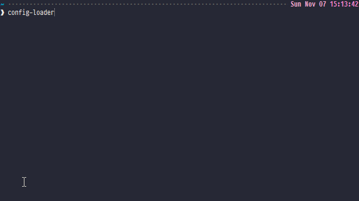

# config-loader
[](LICENSE-MIT)
[](https://github.com/zedseven/config-loader/actions/workflows/integrity.yml)
[](https://github.com/zedseven/config-loader/issues)
[](https://crates.io/crates/config-loader)
[](https://crates.io/crates/config-loader)

A tool for quickly switching between different file configurations, using
symbolic links. This tool aims to make it much more ergonomic to work with
environments where you have to regularly switch out a file's contents or
entire sets of files.

## Usage
To use it, you can either install with Cargo or download the latest release for
your platform from the
[Releases tab](https://github.com/zedseven/config-loader/releases).

To install with Cargo, run
```commandline
cargo install config-loader
```

Upon first launching, it will ask if you want to create a starter config file.

Once the config's created, open it and edit it to your liking. The following is
a (fairly silly) example:

```toml
# Config Loader - https://github.com/zedseven/config-loader

# Here's where you define the file targets. These are the files you
# have to switch out whenever you want to change to a different configuration.
# Please use absolute file paths.
[targets]
cool_picture = "C:\\Users\\Zacc\\Desktop\\CoolPicture.png"
another_cool_picture = "C:\\Users\\Zacc\\Desktop\\VeryCoolPicture.png"

# Here's where each loadout is defined. Include as many files for each loadout
# as you need.
# Each loadout is completely separate from the others. Each one should be a
# complete set of all the files necessary to work.
[[loadouts]]
name = "Bird"
[loadouts.files]
cool_picture = "C:\\Users\\Zacc\\Downloads\\Farfetch'd.png"

[[loadouts]]
name = "Cheese"
[loadouts.files]
cool_picture = "C:\\Users\\Zacc\\Pictures\\Cheese.png"
another_cool_picture = "C:\\Users\\Zacc\\Pictures\\Fromage.png"
```

With the config above, the tool simply swaps out the same `cool_picture`
file with either a picture of a bird, or a picture of cheese - depending on the
selected loadout. It also sets up `another_cool_picture`, but only for the
`Cheese` profile. Loadouts are entirely separate from each other and can change
different files.

Once the config is set up, just run the tool:



You can also load profiles by name, or by the start of the name (first match is what is loaded).
Loadouts are listed in the same order they're defined.

### Note
On Windows machines,
[Administrator privileges are required](https://security.stackexchange.com/a/10198)
to make symbolic links unless you [enable Developer Mode](https://github.com/zedseven/windows-registry-tweaks#developer-mode).
If you get an
```
A required privilege is not held by the client.
```
error, that's why.

If you don't trust the program to give it Administrator privileges, the source
code is available, and you can build it from source.

This program should work on Windows and Unix (Linux, MacOS) systems without a
problem. If you encounter one, please
[open an issue](https://github.com/zedseven/config-loader/issues).

## Project License
This project is licensed under either of

- Apache License, Version 2.0, ([LICENSE-APACHE](LICENSE-APACHE) or
  http://www.apache.org/licenses/LICENSE-2.0)
- MIT license ([LICENSE-MIT](LICENSE-MIT) or
  http://opensource.org/licenses/MIT)

at your option.

### Contribution
Unless you explicitly state otherwise, any contribution intentionally submitted
for inclusion in *config-loader* by you, as defined in the Apache-2.0 license,
shall be dual licensed as above, without any additional terms or conditions.
